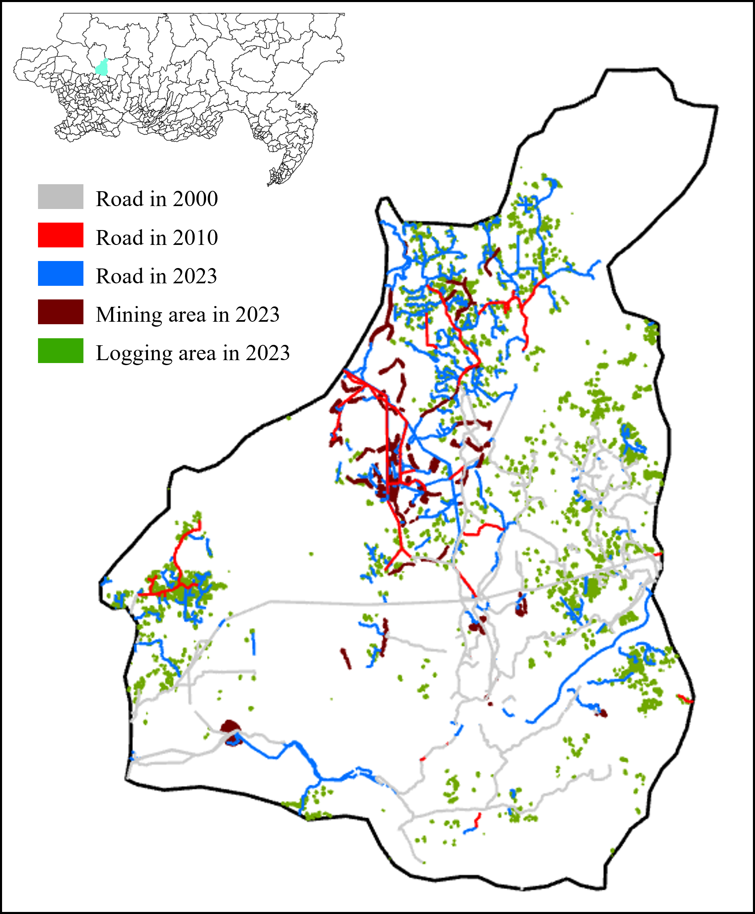

# The Dataset
## Abstract
Here are examples of the various data products we produce that we mentioned in the article. Includes road products for 2000,2010 and 2023, logging maps for 2023 and mining maps for 2023. All data is in raster format with a spatial resolution of 30 meters.

<figure>
  <text-align: center;>
  
</figcaption>
</figure>

## Data structure
```
data 
 ├── Road product
 │      ├── <2000>.tif 
 │      ├── <2010>.tif 
 │      ├── <2023>.tif 
 ├── Logging map
 │      ├── <2023>.tif 
 ├── Mining map
 │      ├── <2023>.tif 
 ├── ROI
 │      ├── <ROI>.shp 
 └──────│
```
